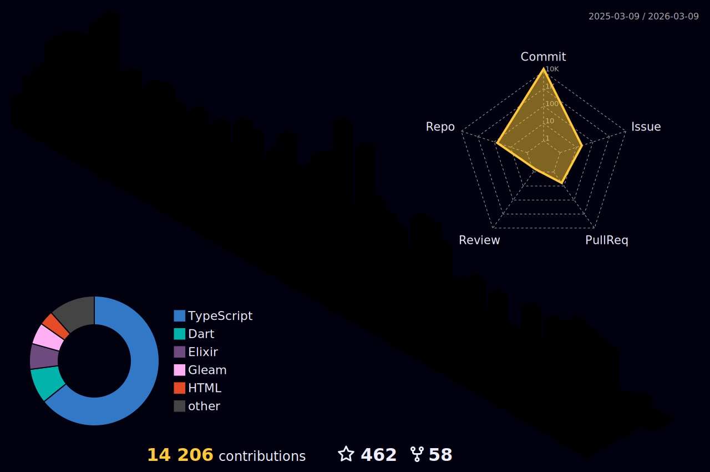

<div align="center">
  
</div>

<div align="center">
  <h1>

</h1>
</div>

<div align="center">
  
  <br>
  <sup><em>The legendary black cat that's actually a developer! 🐾</em></sup>
</div>

<br>

<div align="center">
  <table>
    <tr>
      <td>
        
      </td>
      <td>
        
      </td>
    </tr>
  </table>
</div>

<div align="center">
  
</div>

<div align="center">
  <h2>🎮 3D Contribution Calendar</h2>
  
</div>

---

<div align="center">

## 🎭 About This Mysterious Developer

<details>
<summary>🎩 Click to reveal the mystery...</summary>

<div align="left">

```ascii
    /\_/\  
   ( o.o ) 
    > ^ <    "I'm not a cat, I'm a developer!" 
```

**🎯 Plot Twist:** Started as a cat in 2014 with **Basic**, evolved into a **Senior Software Engineer** with **5+ years** of turning coffee into existential crisis... I mean, code! 💀

**🚀 The Journey:** From **Basic** to **Go, TypeScript, Python, Java, C++**. Now specializing in:
- 🏗️ **Scalable backend systems** (because my life doesn't scale)
- 🤖 **MCP servers** (more reliable than my sleep schedule)
- ✨ **VibeCode** (better vibes than my Monday mornings)
- ☁️ **Cloud architecture** (higher than my stress levels)

**🎪 Current Gig:** Senior Software Developer at [Wave Technologies](https://www.linkedin.com/company/wave-technologies-oficial/) - surfing waves while drowning in coffee! 🏄‍♂️☕

**🎮 When Not Coding:** Movies, music, gaming (and questioning life choices)

</div>
</details>

</div>

---

## 💼 Professional Journey

### 🔥 **Senior Software Developer** | [Wave Technologies](https://www.linkedin.com/company/wave-technologies-oficial/)
**February 2025 - Present | Campina, São Paulo (Remote)**

```typescript
const currentLife = {
  morning: "☕ Coffee + Existential Crisis",
  afternoon: "☁️ AWS/Azure (and anxiety)",
  evening: "🤖 MCP server magic",
  night: "✨ VibeCode (and insomnia)"
};
```

---

### 💻 **Backend Developer** | [Yazo](https://yazo.com.br/)
**November 2020 - February 2025 | Londrina, Paraná (Remote)**

```javascript
const pastLife = {
  achievement: "5+ million users survived my code",
  trauma: "Legacy code that haunts my dreams",
  therapy: "Redis for the pain",
  graduation: "Yazo CLI - my digital offspring"
};
```

---

<div align="center">

## 🛠️ Tech Arsenal

<div align="center">
  
  <br>
  <sup><em>Backend Languages - My weapons of choice</em></sup>
</div>

<br>

<div align="center">
  
  <br>
  <sup><em>Cloud & Infrastructure - Where dreams go to die</em></sup>
</div>

<br>

<div align="center">
  
  <br>
  <sup><em>Databases & Messaging - My data overlords</em></sup>
</div>

<br>

<div align="center">
  
  <br>
  <sup><em>Frontend & Mobile - Making things less ugly</em></sup>
</div>

<br>

<div align="center">
  
  <br>
  <sup><em>Tools & DevOps - My survival kit</em></sup>
</div>

<br>

<div align="center">
  
  
  
  <br>
  <sup><em>Specialized Skills - The forbidden arts</em></sup>
</div>

</div>

---

<div align="center">

## 📊 GitHub Stats

<!--START_SECTION:waka-->


**🐱 My GitHub Data** 

> 📦 757.8 kB Used in GitHub's Storage 
 > 
> 🏆 258 Contributions in the Year 2026
 > 
> 💼 Opted to Hire
 > 
> 📜 112 Public Repositories 
 > 
> 🔑 14 Private Repositories 
 > 
**I'm an Early 🐤** 

```text
🌞 Morning                7288 commits        ███░░░░░░░░░░░░░░░░░░░░░░   13.97 % 
🌆 Daytime                18848 commits       █████████░░░░░░░░░░░░░░░░   36.13 % 
🌃 Evening                16887 commits       ████████░░░░░░░░░░░░░░░░░   32.37 % 
🌙 Night                  9139 commits        ████░░░░░░░░░░░░░░░░░░░░░   17.52 % 
```
📅 **I'm Most Productive on Sunday** 

```text
Monday                   6365 commits        ███░░░░░░░░░░░░░░░░░░░░░░   12.20 % 
Tuesday                  5660 commits        ███░░░░░░░░░░░░░░░░░░░░░░   10.85 % 
Wednesday                6715 commits        ███░░░░░░░░░░░░░░░░░░░░░░   12.87 % 
Thursday                 8519 commits        ████░░░░░░░░░░░░░░░░░░░░░   16.33 % 
Friday                   6601 commits        ███░░░░░░░░░░░░░░░░░░░░░░   12.65 % 
Saturday                 6593 commits        ███░░░░░░░░░░░░░░░░░░░░░░   12.64 % 
Sunday                   11709 commits       ██████░░░░░░░░░░░░░░░░░░░   22.45 % 
```


📊 **This Week I Spent My Time On** 

```text
🕑︎ Time Zone: America/Sao_Paulo

💬 Programming Languages: 
Markdown                 1 hr 28 mins        ██████████░░░░░░░░░░░░░░░   38.63 % 
Elixir                   1 hr 23 mins        █████████░░░░░░░░░░░░░░░░   36.44 % 
Bash                     35 mins             ████░░░░░░░░░░░░░░░░░░░░░   15.61 % 
YAML                     15 mins             ██░░░░░░░░░░░░░░░░░░░░░░░   06.75 % 
Other                    5 mins              █░░░░░░░░░░░░░░░░░░░░░░░░   02.57 % 

🔥 Editors: 
Antigravity              3 hrs 48 mins       █████████████████████████   100.00 % 

💻 Operating System: 
Mac                      3 hrs 48 mins       █████████████████████████   100.00 % 
```

**I Mostly Code in TypeScript** 

```text
TypeScript               55 repos            ███████████░░░░░░░░░░░░░░   45.45 % 
Elixir                   11 repos            ██░░░░░░░░░░░░░░░░░░░░░░░   09.09 % 
JavaScript               6 repos             █░░░░░░░░░░░░░░░░░░░░░░░░   04.96 % 
Svelte                   4 repos             █░░░░░░░░░░░░░░░░░░░░░░░░   03.31 % 
HTML                     2 repos             ░░░░░░░░░░░░░░░░░░░░░░░░░   01.65 % 
```


 Last Updated on 11/01/2026 00:30:39 UTC
<!--END_SECTION:waka-->

</div>

---

<div align="center">

## 🎮 Developer Dark Facts

<table>
  <tr>
    <td align="center" width="33%">
      
      <br><br>
      
      <br>
      <em>From Basic to Burnout!</em>
    </td>
    <td align="center" width="33%">
      
      <br><br>
      
      <br>
      <em>Learning never stops... neither do I!</em>
    </td>
    <td align="center" width="33%">
      
      <br><br>
      
      <br>
      <em>I only have 1 life and 0 sleep!</em>
    </td>
  </tr>
</table>

<details>
<summary>🪦 Click for dark developer secrets...</summary>

```typescript
const darkSecrets = {
  favoriteHours: "3AM debugging sessions 🧟",
  mostProductiveDay: "Tuesday (probably caffeine overdose)",
  currentObsession: "MCP servers and existential dread",
  hiddenTalent: "Making databases cry",
  superPower: "Converting coffee to depression... I mean, code",
  weekendActivity: "Pretending to have work-life balance",
  catEnvy: "Cats sleep 16h/day, I sleep 4h/day 😭",
  realityCheck: "Still figuring out this whole 'being human' thing",
  codingTrauma: "Legacy code that haunts my dreams",
  therapySession: "Stack Overflow is my therapist"
};
```

</details>

</div>

---

<div align="center">

## 🌐 Connect with the Suffering Developer

<div align="center">
  <a href="mailto:gabrielmaialva33@gmail.com">
    
  </a>
  <a href="https://www.linkedin.com/in/gabriel-maia-183984239">
    
  </a>
  <a href="https://github.com/gabrielmaialva33">
    
  </a>
  <a href="https://t.me/sr_mrootx">
    
  </a>
</div>

<br>

<div align="center">
  
  
</div>

</div>

---

<div align="center">
  <h3>
    
    &nbsp; Made with ❤️, lots of ☕, and a touch of 💀 existential dread
    <br>
    <sup>&copy; 2017-present <a href="https://github.com/gabrielmaialva33/" target="_blank">Maia</a> | Still alive... barely</sup>
  </h3>
</div>

<div align="center">
  
</div>