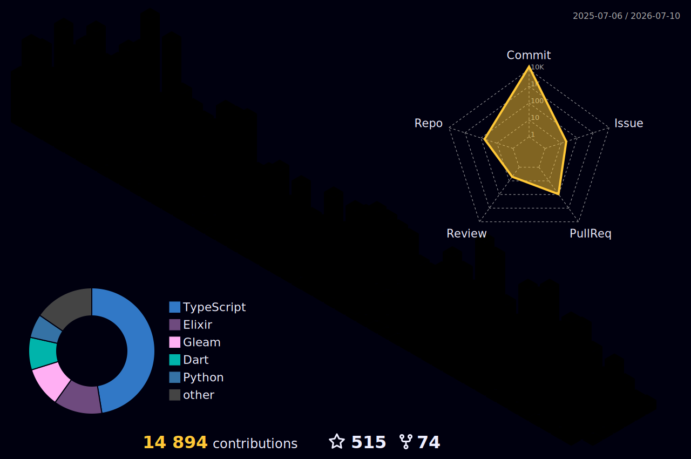

<!--
  ╭─────────────────────────────────────────────────────────╮
  │  Gabriel Maia · Senior Software Developer · 2017-Present │
  │  Tokyo Night theme · Brazil 🇧🇷 · MCP & Agentic Specialist │
  ╰─────────────────────────────────────────────────────────╯
-->

<div align="center">
  
</div>

<div align="center">

<a href="https://github.com/gabrielmaialva33"></a>

<br/>


<sub><em>The legendary black cat that's actually a developer</em></sub>

<br/><br/>

<a href="mailto:gabrielmaialva33@gmail.com"></a>
<a href="https://www.linkedin.com/in/gabriel-maia-183984239"></a>
<a href="https://t.me/sr_mrootx"></a>
<a href="https://github.com/gabrielmaialva33"></a>

<br/>


</div>

<br/>

<!-- ═══════════════ HERO STATS ═══════════════ -->

<div align="center">

<table>
<tr>
<td valign="top" width="50%">


</td>
<td valign="top" width="50%">


</td>
</tr>
</table>


</div>

---

<!-- ═══════════════ ABOUT ═══════════════ -->

<div align="center">

## 🎭 About

</div>

```typescript
const gabriel: Developer = {
    name: "Gabriel Maia",
    role: "Senior Software Developer",
    company: "DrConsulta · São Paulo, Brazil 🇧🇷",
    origin: "Self-taught since 2014 · From Basic to Rust",

    stack: {
        daily: ["TypeScript", "Go", "Python", "Rust"],
        cloud: ["AWS", "Azure", "GCP", "Docker", "Kubernetes"],
        data: ["PostgreSQL", "Redis", "Kafka", "Elasticsearch"],
        obsessed: ["MCP servers", "Agentic systems", "VibeCode"],
    },

    metrics: {
        yearsCoding: "5+ professional · 12 total",
        linesOfCode: "27.38M+",
        contributionsYr: 3821,
        repos: "135 public · 15 private",
        favoriteHour: "3AM · debugging in the dark",
    },

    hobbies: ["movies 🎬", "music 🎧", "gaming 🎮", "OSINT 🕵️"],
};
```

<details>
<summary><b>🎩 Click for the full origin story</b></summary>

<br/>

```ascii
    /\_/\        ┌─────────────────────────────────────┐
   ( o.o )       │  2014 · Basic on a borrowed laptop  │
    > ^ <        │  2017 · First GitHub commit         │
                 │  2020 · Backend dev @ Yazo          │
                 │  2025 · Senior @ Wave Technologies  │
                 │  2026 · Senior @ DrConsulta · MCP   │
                 └─────────────────────────────────────┘
```

**🚀 The Journey** — From Basic to **Go, TypeScript, Python, Rust, Java, C++**.
Now specializing in **scalable backends**, **MCP server engineering**, **agentic AI integration**, and **cloud-native
architecture**.

**🎯 Currently obsessed with** — autonomous agents, retrieval-augmented systems, real-time observability, and pretending
I have a sleep schedule.

</details>

---

<!-- ═══════════════ PROFESSIONAL JOURNEY ═══════════════ -->

<div align="center">

## 💼 Professional Journey

<sub>Timeline · most recent first</sub>

</div>

<table align="center">
<tr>
<td width="35%" valign="top">

### 🟢 **Current**

**Senior Software Developer**
[`@DrConsulta`](https://drconsulta.com/)

📍 São Paulo, Brazil
📅 March 2026 — Present

</td>
<td width="65%" valign="top">

```typescript
const currentRole = {
    morning: "☕ Coffee + architecture decisions",
    midday: "🤖 Building MCP servers & agents",
    afternoon: "☁️ Cloud infra (AWS / Azure)",
    evening: "✨ VibeCode + scalable backends",
    focus: ["Healthcare-tech", "AI integration", "DevX"],
};
```

</td>
</tr>

<tr><td colspan="2"><br/></td></tr>

<tr>
<td width="35%" valign="top">

### 🌊 **Previous**

**Senior Software Developer**
[`@Wave Technologies`](https://www.linkedin.com/company/wave-technologies-oficial/)

📍 Campinas, SP (Remote)
📅 Feb 2025 — Feb 2026

</td>
<td width="65%" valign="top">

```typescript
const wavePeriod = {
    highlights: ["AWS migrations", "MCP integrations"],
    built: "Internal agentic tooling + cloud pipelines",
    scale: "Multi-region production workloads",
    vibe: "🏄‍♂️ Surfing waves, drowning in coffee",
};
```

</td>
</tr>

<tr><td colspan="2"><br/></td></tr>

<tr>
<td width="35%" valign="top">

### 💻 **Foundation**

**Backend Developer**
[`@Yazo`](https://yazo.com.br/)

📍 Londrina, PR (Remote)
📅 Nov 2020 — Feb 2025

</td>
<td width="65%" valign="top">

```typescript
const yazoYears = {
    achievement: "5M+ users served by my code",
    built: "Yazo CLI · my digital firstborn",
    scaled: "Legacy → modern microservices",
    therapy: "Redis cured the latency PTSD 💊",
};
```

</td>
</tr>
</table>

---

<!-- ═══════════════ TECH ARSENAL ═══════════════ -->

<div align="center">

## 🛠️ Tech Arsenal

<table>
<tr>
<td align="center" valign="top" width="33%">

#### 🔷 Backend


<br/>
<sub>The weapons of choice</sub>

</td>
<td align="center" valign="top" width="33%">

#### ☁️ Cloud & DevOps


<br/>
<sub>Where dreams scale</sub>

</td>
<td align="center" valign="top" width="33%">

#### 🗄️ Data & Messaging


<br/>
<sub>The data overlords</sub>

</td>
</tr>
<tr>
<td align="center" valign="top">

#### 🎨 Frontend & Mobile


<br/>
<sub>Making things prettier</sub>

</td>
<td align="center" valign="top">

#### 🧰 Tools


<br/>
<sub>The survival kit</sub>

</td>
<td align="center" valign="top">

#### ✨ Specialized


<br/>
<sub>The forbidden arts</sub>

</td>
</tr>
</table>

</div>

---

<!-- ═══════════════ FEATURED PROJECTS ═══════════════ -->

<div align="center">

## 🚀 Featured Projects

<sub>Top repos by ⭐ · live data via shields.io</sub>

</div>

<table>
<tr>
<td valign="top" width="50%">

#### [🦀 winx-code-agent](https://github.com/gabrielmaialva33/winx-code-agent)
<a href="https://github.com/gabrielmaialva33/winx-code-agent">


</a>

> ✨ High-performance code agent in Rust, combining best features of WCGW for max efficiency and semantic capabilities. 🦀

</td>
<td valign="top" width="50%">

#### [🐍 anthropic-proxy](https://github.com/gabrielmaialva33/anthropic-proxy)
<a href="https://github.com/gabrielmaialva33/anthropic-proxy">


</a>

> 🤖 Proxy that lets you use Claude Code with any OpenAI-compatible model — GPT-4o, OpenRouter, DeepSeek, Ollama, and more.

</td>
</tr>
<tr>
<td valign="top" width="50%">

#### [💬 mahina-bot](https://github.com/gabrielmaialva33/mahina-bot)
<a href="https://github.com/gabrielmaialva33/mahina-bot">


</a>

> 🎵 Discord bot for server admins — moderation, music, fun commands. Built with TypeScript.

</td>
<td valign="top" width="50%">

#### [🎶 flora-music-bot](https://github.com/gabrielmaialva33/flora-music-bot)
<a href="https://github.com/gabrielmaialva33/flora-music-bot">


</a>

> 🚀 Powerful music & video bot for Telegram with Pyrogram + Py-Tgcalls. Stream music, videos, live broadcasts.

</td>
</tr>
<tr>
<td valign="top" width="50%">

#### [🔓 camera-hack](https://github.com/gabrielmaialva33/camera-hack)
<a href="https://github.com/gabrielmaialva33/camera-hack">


</a>

> 🛡️ Root shell + persistent hack on a Yoosee/Jortan IP camera (Anyka AK3918EV330) via UART serial + Arduino bridge.

</td>
<td valign="top" width="50%">

#### [🧠 viva](https://github.com/gabrielmaialva33/viva)
<a href="https://github.com/gabrielmaialva33/viva">


</a>

> 🌌 Not a chatbot. Not a virtual assistant. A serious attempt to create genuine digital life. Built in Gleam/OTP.

</td>
</tr>
<tr>
<td valign="top" width="50%">

#### [📺 streamix](https://github.com/gabrielmaialva33/streamix)
<a href="https://github.com/gabrielmaialva33/streamix">


</a>

> 🎬 Premium consolidated streaming — bringing all your IPTV providers into one intelligent, beautiful interface.

</td>
<td valign="top" width="50%">

#### [🖥️ Hackintosh-Z790](https://github.com/gabrielmaialva33/Hackintosh-13900k-z790-ASUS-MAXIMUS-HERO)
<a href="https://github.com/gabrielmaialva33/Hackintosh-13900k-z790-ASUS-MAXIMUS-HERO">


</a>

> 🍎 OpenCore EFI for ASUS ROG MAXIMUS Z790 HERO + i9-13900K + RTX 4090 + RX 570 · macOS Sequoia 15.7.3.

</td>
</tr>
</table>

<details align="center">
<summary><b>📌 View as Pin Cards</b> (loaded via mirror — click to expand)</summary>

<br/>

<div align="center">
<a href="https://github.com/gabrielmaialva33/winx-code-agent"></a>
<a href="https://github.com/gabrielmaialva33/anthropic-proxy"></a>
<a href="https://github.com/gabrielmaialva33/mahina-bot"></a>
<a href="https://github.com/gabrielmaialva33/flora-music-bot"></a>
</div>

</details>

---

<!-- ═══════════════ STATS DEEP DIVE ═══════════════ -->

<div align="center">

## 📊 GitHub Stats Deep Dive


<table>
<tr>
<td valign="top" width="50%">


</td>
<td valign="top" width="50%">


</td>
</tr>
<tr>
<td valign="top" width="50%">


</td>
<td valign="top" width="50%">


</td>
</tr>
</table>

<br/>

### 🏆 Trophy Case

<a href="https://github.com/ryo-ma/github-profile-trophy">
  
</a>

<br/><br/>

### 🎮 3D Contribution Calendar



<br/>

### 🐍 Contribution Snake


</div>

---

<!-- ═══════════════ WAKATIME ═══════════════ -->

<div align="center">

## ⏱️ WakaTime Coding Activity

<sub>Auto-updated daily via GitHub Actions</sub>

</div>

<!--START_SECTION:waka-->


**🐱 My GitHub Data** 

> 📦 983.6 kB Used in GitHub's Storage 
 > 
> 🏆 5,769 Contributions in the Year 2026
 > 
> 💼 Opted to Hire
 > 
> 📜 135 Public Repositories 
 > 
> 🔑 16 Private Repositories 
 > 
**I'm an Early 🐤** 

```text
🌞 Morning                8645 commits        ████░░░░░░░░░░░░░░░░░░░░░   15.29 % 
🌆 Daytime                20993 commits       █████████░░░░░░░░░░░░░░░░   37.14 % 
🌃 Evening                17210 commits       ████████░░░░░░░░░░░░░░░░░   30.44 % 
🌙 Night                  9681 commits        ████░░░░░░░░░░░░░░░░░░░░░   17.13 % 
```
📅 **I'm Most Productive on Sunday** 

```text
Monday                   6742 commits        ███░░░░░░░░░░░░░░░░░░░░░░   11.93 % 
Tuesday                  6664 commits        ███░░░░░░░░░░░░░░░░░░░░░░   11.79 % 
Wednesday                7748 commits        ███░░░░░░░░░░░░░░░░░░░░░░   13.71 % 
Thursday                 9618 commits        ████░░░░░░░░░░░░░░░░░░░░░   17.01 % 
Friday                   7650 commits        ███░░░░░░░░░░░░░░░░░░░░░░   13.53 % 
Saturday                 7053 commits        ███░░░░░░░░░░░░░░░░░░░░░░   12.48 % 
Sunday                   11054 commits       █████░░░░░░░░░░░░░░░░░░░░   19.55 % 
```


📊 **This Week I Spent My Time On** 

```text
🕑︎ Time Zone: America/Sao_Paulo

💬 Programming Languages: 
Markdown                 17 hrs 54 mins      ██████░░░░░░░░░░░░░░░░░░░   22.64 % 
Python                   12 hrs 50 mins      ████░░░░░░░░░░░░░░░░░░░░░   16.22 % 
C                        11 hrs 18 mins      ████░░░░░░░░░░░░░░░░░░░░░   14.29 % 
TOML                     4 hrs 38 mins       █░░░░░░░░░░░░░░░░░░░░░░░░   05.87 % 
Rust                     4 hrs 37 mins       █░░░░░░░░░░░░░░░░░░░░░░░░   05.84 % 

🔥 Editors: 
Claude Code              51 hrs 6 mins       ████████████████░░░░░░░░░   64.58 % 
VS Code                  13 hrs 6 mins       ████░░░░░░░░░░░░░░░░░░░░░   16.56 % 
PyCharm                  6 hrs 9 mins        ██░░░░░░░░░░░░░░░░░░░░░░░   07.77 % 
CLion                    3 hrs 57 mins       █░░░░░░░░░░░░░░░░░░░░░░░░   04.99 % 
IntelliJ IDEA            2 hrs 44 mins       █░░░░░░░░░░░░░░░░░░░░░░░░   03.47 % 

💻 Operating System: 
Linux                    79 hrs 7 mins       █████████████████████████   100.00 % 
```

**I Mostly Code in TypeScript** 

```text
TypeScript               62 repos            ██████████░░░░░░░░░░░░░░░   41.33 % 
Python                   16 repos            ███░░░░░░░░░░░░░░░░░░░░░░   10.67 % 
Rust                     6 repos             █░░░░░░░░░░░░░░░░░░░░░░░░   04.00 % 
Kotlin                   5 repos             █░░░░░░░░░░░░░░░░░░░░░░░░   03.33 % 
C                        3 repos             ░░░░░░░░░░░░░░░░░░░░░░░░░   02.00 % 
```


 Last Updated on 28/05/2026 00:55:08 UTC
<!--END_SECTION:waka-->

---

<!-- ═══════════════ DARK FACTS ═══════════════ -->

<div align="center">

## 🎮 Developer Dark Facts

<table>
<tr>
<td align="center" width="33%" valign="top">
  
  <br/><br/>
  
  <br/>
  <sub><em>From Basic to Brilliant</em></sub>
</td>
<td align="center" width="33%" valign="top">
  
  <br/><br/>
  
  <br/>
  <sub><em>Learning never stops</em></sub>
</td>
<td align="center" width="33%" valign="top">
  
  <br/><br/>
  
  <br/>
  <sub><em>I only have 1 life and 0 sleep</em></sub>
</td>
</tr>
</table>

<details>
<summary><b>🪦 Click for dark developer secrets</b></summary>

<br/>

```typescript
const darkSecrets = {
    favoriteHours: "3AM debugging sessions 🧟",
    mostProductiveDay: "Tuesday (probably caffeine overdose)",
    currentObsession: "MCP servers, agentic loops, existential dread",
    hiddenTalent: "Making databases cry",
    superPower: "Converting coffee to depression... I mean, code",
    weekendActivity: "Pretending to have work-life balance",
    catEnvy: "Cats sleep 16h/day, I sleep 4h/day 😭",
    realityCheck: "Still figuring out this whole 'being human' thing",
    codingTrauma: "Legacy code that haunts my dreams",
    therapySession: "Stack Overflow is my therapist",
};
```

</details>

</div>

---

<!-- ═══════════════ QUOTE ═══════════════ -->

<div align="center">

## 💭 Random Dev Quote


</div>

---

<!-- ═══════════════ CONNECT ═══════════════ -->

<div align="center">

## 🌐 Let's Connect

<sub>Always open to interesting conversations · MCP · Agentic AI · Backend architecture</sub>

<br/><br/>

<a href="mailto:gabrielmaialva33@gmail.com">
  
</a>
<a href="https://www.linkedin.com/in/gabriel-maia-183984239">
  
</a>
<a href="https://github.com/gabrielmaialva33">
  
</a>
<a href="https://t.me/mrootx">
  
</a>

</div>

<br/>

<div align="center">

```text
> Made with ❤️, lots of ☕, and a touch of 💀 existential dread
> © 2017—present · Maia · Still alive... barely
```


</div>
