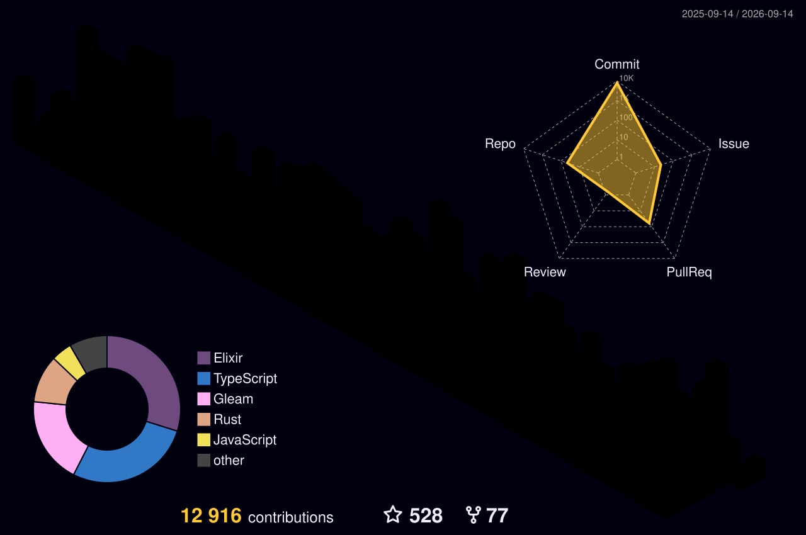

<!--
  ╭──────────────────────────────────────────────────────────╮
  │ Gabriel Maia · Senior Software Developer                 │
  │ Backend · MCP · Agentic Systems · Cloud · Open Source   │
  ╰──────────────────────────────────────────────────────────╯
-->

<div align="center">
  
</div>

<div align="center">

<a href="https://github.com/gabrielmaialva33"></a>

<br/>


<sub><em>The black cat developer: building serious systems without taking the README too seriously.</em></sub>

<br/><br/>

<a href="mailto:gabrielmaialva33@gmail.com"></a>
<a href="https://www.linkedin.com/in/gabriel-maia-183984239"></a>
<a href="https://t.me/sr_mrootx"></a>
<a href="https://github.com/gabrielmaialva33"></a>

<br/>


</div>

---

<div align="center">

## 🎭 About

</div>

> I design and evolve backend platforms, developer tooling, MCP servers, and agentic systems. I care about explicit boundaries, observable behavior, operational simplicity, and software that remains understandable after the first successful release.

```typescript
const gabriel = {
    name: "Gabriel Maia",
    role: "Senior Software Developer",
    company: "DrConsulta",
    location: "São Paulo, Brazil 🇧🇷",
    codingSince: 2014,
    professionalSince: 2020,

    focus: [
        "Backend and distributed systems",
        "MCP servers and agentic tooling",
        "Cloud-native architecture",
        "Developer experience and automation",
    ],

    dailyStack: ["TypeScript", "Go", "Python", "Rust", "Elixir"],
    principles: ["clarity", "security", "observability", "maintainability"],
    beyondCode: ["cinema", "music", "gaming", "embedded systems", "OSINT"],
};
```

<details>
<summary><b>🎩 The origin story</b></summary>

<br/>

```text
    /\_/\        2014  BASIC on a borrowed laptop
   ( o.o )       2017  First public GitHub work
    > ^ <        2020  Backend Developer at Yazo
                 2025  Senior Software Developer at Wave Technologies
                 2026  Senior Software Developer at DrConsulta
```

A self-taught path from BASIC to production systems in **TypeScript, Go, Python, Rust, Elixir, Java, and C++**. Today, the work is centered on scalable backends, AI integration, cloud platforms, and tools that help other developers move with more confidence.

</details>

---

<div align="center">

## 💼 Professional Journey

<sub>Most recent first</sub>

</div>

<table>
<tr>
<td width="32%" valign="top">

### 🟢 DrConsulta

**Senior Software Developer**<br/>
São Paulo, Brazil<br/>
**Mar 2026 — Present**

</td>
<td width="68%" valign="top">

Backend architecture for healthcare technology, MCP and agent integrations, cloud platforms, and developer experience. The focus is dependable systems, clear domain boundaries, and automation that supports—not replaces—engineering judgment.

</td>
</tr>
<tr>
<td width="32%" valign="top">

### 🌊 Wave Technologies

**Senior Software Developer**<br/>
Campinas, SP · Remote<br/>
**Feb 2025 — Feb 2026**

</td>
<td width="68%" valign="top">

Cloud migrations, multi-region workloads, internal agentic tooling, backend modernization, and production operations across AWS-based environments.

</td>
</tr>
<tr>
<td width="32%" valign="top">

### 💻 Yazo

**Backend Developer**<br/>
Londrina, PR · Remote<br/>
**Nov 2020 — Feb 2025**

</td>
<td width="68%" valign="top">

Backend services, APIs, CLI tooling, data infrastructure, and the modernization of systems used at large scale. This period established the foundation for my work in distributed systems and developer tooling.

</td>
</tr>
</table>

---

<div align="center">

## 🛠️ Tech Arsenal

<table>
<tr>
<td align="center" valign="top" width="33%">

#### 🔷 Backend


<sub>Services, APIs, workers, and distributed systems</sub>

</td>
<td align="center" valign="top" width="33%">

#### ☁️ Cloud & Platform


<sub>Infrastructure that can be operated with confidence</sub>

</td>
<td align="center" valign="top" width="33%">

#### 🗄️ Data & Messaging


<sub>Persistence, caching, search, and asynchronous workflows</sub>

</td>
</tr>
<tr>
<td align="center" valign="top">

#### 🎨 Product Interfaces


<sub>Enough frontend to deliver complete products</sub>

</td>
<td align="center" valign="top">

#### 🧰 Engineering Tools


<sub>Feedback loops, collaboration, and automation</sub>

</td>
<td align="center" valign="top">

#### ✨ Specialized


</td>
</tr>
</table>

</div>

---

<div align="center">

## 🚀 Featured Work

<sub>A curated selection of current and representative projects</sub>

</div>

<table>
<tr>
<td valign="top" width="50%">

#### [🦀 winx-code-agent](https://github.com/gabrielmaialva33/winx-code-agent)

<a href="https://github.com/gabrielmaialva33/winx-code-agent"></a>


High-performance code agent with a PTY-backed shell, surgical file operations, and semantic code navigation.

</td>
<td valign="top" width="50%">

#### [📺 streamix](https://github.com/gabrielmaialva33/streamix)

<a href="https://github.com/gabrielmaialva33/streamix"></a>


Multi-platform streaming platform focused on fast startup, resilient playback, and a consistent experience across browsers and devices.

</td>
</tr>
<tr>
<td valign="top" width="50%">

#### [🧠 viva](https://github.com/gabrielmaialva33/viva)

<a href="https://github.com/gabrielmaialva33/viva"></a>


Gleam/OTP research project exploring persistent digital agents, memory, emotion, and emergent behavior.

</td>
<td valign="top" width="50%">

#### [🐍 anthropic-proxy](https://github.com/gabrielmaialva33/anthropic-proxy)

<a href="https://github.com/gabrielmaialva33/anthropic-proxy"></a>


Compatibility gateway connecting Claude Code-style clients to OpenAI-compatible providers and local models.

</td>
</tr>
<tr>
<td valign="top" width="50%">

#### [📼 esp32-crt-signal-core](https://github.com/gabrielmaialva33/esp32-crt-signal-core)

<a href="https://github.com/gabrielmaialva33/esp32-crt-signal-core"></a>


ESP32 composite-video generator and CRT lab toolkit for NTSC/PAL calibration, test patterns, and remote monitoring.

</td>
<td valign="top" width="50%">

#### [⚡ adonis-web-kit](https://github.com/gabrielmaialva33/adonis-web-kit)

<a href="https://github.com/gabrielmaialva33/adonis-web-kit"></a>


Reusable AdonisJS application kit focused on clean architecture, production-minded defaults, and developer experience.

</td>
</tr>
</table>

<details>
<summary><b>📚 More open-source work</b></summary>

<br/>

- [camera-hack](https://github.com/gabrielmaialva33/camera-hack) — authorized embedded-security research on personally owned Yoosee/Jortan hardware using UART and an Arduino bridge.
- [mahina-bot](https://github.com/gabrielmaialva33/mahina-bot) — TypeScript Discord bot for moderation, music, and community tools.
- [flora-music-bot](https://github.com/gabrielmaialva33/flora-music-bot) — Telegram group-call streaming bot for music, video, and live broadcasts.
- [Hackintosh Z790](https://github.com/gabrielmaialva33/Hackintosh-13900k-z790-ASUS-MAXIMUS-HERO) — documented OpenCore configuration for a custom desktop build.
- [awesome-mcp-servers](https://github.com/gabrielmaialva33/awesome-mcp-servers) — curated references and implementations from the MCP ecosystem.

</details>

---

<div align="center">

## 🧭 Engineering Approach

</div>

```typescript
const engineeringPrinciples = [
    "Make domain boundaries explicit before adding abstractions",
    "Prefer observable behavior over silent magic",
    "Automate repetitive work while keeping decisions reviewable",
    "Treat security and maintainability as product features",
    "Optimize after measuring, not before understanding",
];
```

---

<div align="center">

## 📊 GitHub Activity

<table>
<tr>
<td valign="top" width="50%">

</td>
<td valign="top" width="50%">

</td>
</tr>
</table>


### 🎮 3D Contribution Calendar



<details>
<summary><b>🐍 Contribution snake</b></summary>

<br/>


</details>

</div>

---

<div align="center">

## ⏱️ Development Activity

<sub>A deliberately compact view, refreshed daily by GitHub Actions</sub>

</div>

<!--START_SECTION:waka-->


**I Mostly Code in TypeScript** 

```text
TypeScript               67 repos            ██████████░░░░░░░░░░░░░░░   41.36 % 
Elixir                   13 repos            ██░░░░░░░░░░░░░░░░░░░░░░░   08.02 % 
Rust                     6 repos             █░░░░░░░░░░░░░░░░░░░░░░░░   03.70 % 
HTML                     3 repos             ░░░░░░░░░░░░░░░░░░░░░░░░░   01.85 % 
C                        3 repos             ░░░░░░░░░░░░░░░░░░░░░░░░░   01.85 % 
```


 Last Updated on 31/08/2026 09:56:33 UTC
<!--END_SECTION:waka-->

---

<div align="center">

## 🐾 Beyond Code

</div>

```typescript
const afterHours = {
    cinema: "Arthouse, horror, animation, and films that refuse easy answers",
    audio: "Music discovery and carefully over-engineered playlists",
    hardware: "CRT restoration, ESP32 experiments, and embedded systems",
    desktop: "Arch Linux, performance tuning, and tasteful ricing",
    mascot: "A black cat that claims credit for every successful deployment",
};
```

---

<div align="center">

## 🌐 Let's Connect

<sub>Backend architecture · MCP · agentic systems · cloud · open source</sub>

<br/><br/>

<a href="mailto:gabrielmaialva33@gmail.com"></a>
<a href="https://www.linkedin.com/in/gabriel-maia-183984239"></a>
<a href="https://github.com/gabrielmaialva33"></a>
<a href="https://t.me/sr_mrootx"></a>

<br/><br/>

<sub>Built with curiosity, care, and enough coffee to keep the tests green.</sub>


</div>
